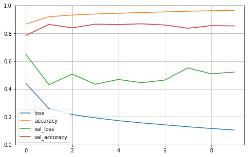
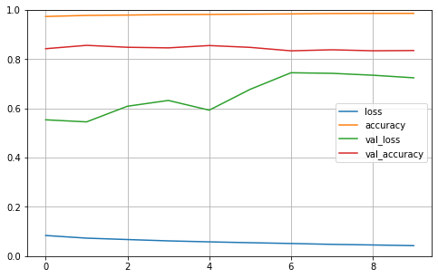
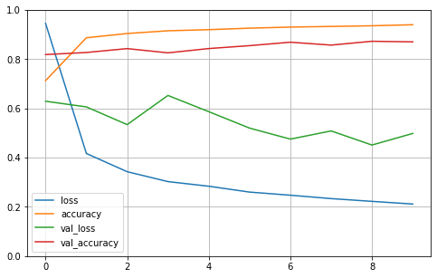

# 神经网络文本分类实例

**环境说明：**

- tensorflow 2.0.0（GPU）
- python 3.6.10
- gensim 3.8.0

>> 数据集、word2vec模型下载：
>> 
>> 链接：https://pan.baidu.com/s/1YfzMCCXI5xusOB6FDExTxg 
>> 提取码：1wlq
>
> 数据集为新闻数据集，共有十个类别。训练集50000，验证集5000，测试集10000。

---

使用了gensim的word2vec模型训练词嵌入模型，通过字典和Embedding层可实现词的向量化

## 使用LSTM模型的神经网络（RNN）

**1. Input -> Embedding -> LSTM -> Output**

   

**2. Input -> Embedding -> LSTM -> Dense -> Dropout ->Output**

   

**3. Input -> Embedding -> LSTM -> Dropout -> Dense -> Dropout -> Dense -> Dropout ->Output**

   

*（在第三个模型上，测试机的 Accuray 为 0.9177，Loss 为 0.287）*

